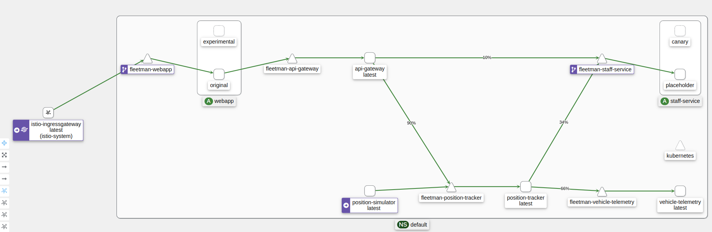
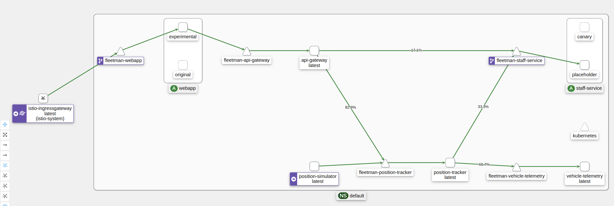

# istio-mesh
A playground running Minikube + Istio and a demo application running on mesh.

## Requirements
- kubectl
- istioctl
- minikube

*All versions covererd in the `.tools-versions` file.*

## Environment

Before running the environment, you can use Docker do run the envoy demo:
```bash
docker build -f envoy_demo/Dockerfile envoy_demo/ -t envoy:demo

docker run -it -p 10000:10000 -p 9901:9901 envoy:demo
```

Go to http://localhost:10000/google and http://localhost:10000/ifood to see the difference.

Try also to explode the Admin API on http://localhost:9901.

## Installing Minikube

Use the following to start Minikube:
```bash
minikube start --kubernetes-version=v1.25.8 --service-cluster-ip-range=172.16.0.0/16 --memory="6g" --cpus="4"
```

## Istio Core
Install IstioD, ingress and egress gateways:
```bash
istioctl install --set profile=demo -y
```

Add a namespace label to instruct Istio to automatically inject Envoy sidecar proxies:
```bash
kubectl label namespace default istio-injection=enabled
```

## Addons
Install [Addons](https://github.com/istio/istio/tree/release-1.16/samples/addons): Grafana, Kiali, Jaeger and Prometheus
```bash
kubectl apply -f addons/
```

Check if everything is running and ready:
```text
$ kubectl get pods -n istio-system
NAME                                    READY   STATUS    RESTARTS        AGE
grafana-56bdf8bf85-zrvqp                1/1     Running   0               2m16s
istio-egressgateway-c58dd6466-wvz9p     1/1     Running   1 (6m13s ago)   64m
istio-ingressgateway-57c484dcb8-bj2d6   1/1     Running   1 (6m13s ago)   64m
istiod-85d7df6df7-kbfc9                 1/1     Running   1 (6m13s ago)   64m
jaeger-c4fdf6674-4fzhp                  1/1     Running   0               2m14s
kiali-849958788-jvpqk                   1/1     Running   0               2m11s
prometheus-85949fddb-qbfmd              2/2     Running   0               2m10s
```

### Addons access
```
istioctl dashboard <addon> -n istio-system
```

Addon may be: `grafana`, `prometheus`, `kiali` or `jaeger`.

See [Installation Configuration Profiles](https://istio.io/latest/docs/setup/additional-setup/config-profiles/).

## Deploying demo application

Demo application are adaptations from the the following project: https://github.com/DickChesterwood/istio-fleetman

For each scenario, make sure to do a cleanup `kubectl delete -f istio-fleetman/0x-xxxxxxx/` before proceeding.

### 01-no-istio-crds

Full working application, without VirtualServices and DestionationRules.

Go to http://$MINIKUBE_IP:30080

``` bash
kubectl apply -f istio-fleetman/01-no-istio-crds/01-manifests.yaml
```

- See traffic on Kiali.
- See tracings on Jaeger.

### 02-no-istio-crds-bodge-canary

Still no Istio CRDs, but with two staff-service deployments using different replicas counts.

```bash
kubectl apply -f istio-fleetman/02-no-istio-crds-bodge-canary/01-manifests.yaml
```

- See traffic balancing between 2 versions from staff-service. A bad canary based only on replicas count.
  - Note the `version` labels.
- Use Kiali to manipulatate traffic (i.e., create VirtualServices and DestionationRules).
  - Use Actions to suspend the staff-service traffic. See erros in the webpapp.
  - Use Kiali to create a weighted routing (only 10% place holders, for example).

You may want to use curl to test the weighting properly:
```bash
MINIKUBE_IP="$(minikube ip)"
while true; do curl "http://${MINIKUBE_IP}:30080/api/vehicles/driver/City%20Truck"; sleep 0.5; echo; done
```

Try to understand: What are VirtualServices and DestinationRules for?

### 03-with-crds-frontend-canary

Apply the files in order, testing each sugestion before proceeding.

The file below create two different deployment for the frontend webapp. The one with the `-experimental` tag has on red bar on the top.

```bash
kubectl apply -f istio-fleetman/03-with-crds-frontend-canary/01-manifests.yaml
```

Go to http://$MINIKUBE_IP:30080 on your web browser. Do some refresh and try to see both versions (it's recommended to clear your browser's cache before trying).

You can also use `curl` to see the balancing:
```bash
while true; do curl -s "http://${MINIKUBE_IP}:30080" | grep title; sleep 0.5; echo; done
```

Create a weighted routing using Kiali. Try to make only 5% of the requests go to experimental version.

**Question**: Why this does not work? Why it worked before for staff-service?
<details>
  <summary><b>Answer:</b></summary>
  Because the proxies run <b>after</b> a container makes request.<br>

  There is no proxy present when the requests are made from outside into the cluster. To solve this, you need to create edge proxy (i.e., a <b>Gateway</b>).
</details>

Before proceeding, remove through Kiali (or using `kubectl`) the `virtualservices` and `destinationrules` created by Kiali.

Recreate those CRDs applying the next file from this scenario:
```bash
kubectl apply -f istio-fleetman/03-with-crds-frontend-canary/02-istio-crds.yaml
```

This should create a similiar VirtualService and DestinationRule, as created by the Kiali UI. The weighted routing is still not working.

Now, apply the Gateway file:
```bash
kubectl apply -f istio-fleetman/03-with-crds-frontend-canary/03-gateway-crd.yaml
```

The `Gateway` CRD will create a listening on port 80 for the envoys selected by the label `istio: ingressgateway`, i.e., the Istio Ingess Gateway from `istio-system` namespace.

Note that the `VirtualService` created in the previous step now mentions these Gateways. From now on, you need to use the Ingress Gateway node port for the requests:
```bash
MINIKUBE_IP="$(minikube ip)"
INGRESS_NODE_PORT=$(kubectl get svc istio-ingressgateway -n istio-system -o jsonpath='{.spec.ports[?(@.port==80)].nodePort}')

while true; do curl -s "http://${MINIKUBE_IP}:${INGRESS_NODE_PORT}" | grep title; sleep 0.5; echo; done
```

Make some requests,  either in your browser or using the above `curl` command. The gateway is now acting as proxy edge, so weighted route must work properly this time.

At this point, you can even edit the webapp kubernetes `service`, removing its `NodePort` and changing it to a regular `ClusterIP` service.

### 04-with-crds-complete-canary

This is a more complete scenario with canary set for both webapp and staff services.

Instead using weighting, the traffic split is configured to use header matching. Requests containing the header `my-special-header: canary` should go to respective canary versions.

You can apply all these files at once:
```bash
kubectl apply -f istio-fleetman/04-with-crds-complete-canary/
```

The service from webapp is now a `ClusterIP` service, the only way to access the frontend is through the ingress, so remember to export Minikube IP and the ingress port:
```bash
export MINIKUBE_IP="$(minikube ip)"
export INGRESS_NODE_PORT=$(kubectl get svc istio-ingressgateway -n istio-system -o jsonpath='{.spec.ports[?(@.port==80)].nodePort}')
```

Start with browser requests **without any extra headers**, you should see only requests going to the `original` and `placeholder` versions from `webapp` and `staff-service`, respectively. That's ok.



Now, try **passing the header `my-special-header: canary`**, using any extension to modify the request header on your browser. It's is expected that both services are now using their alternative versions, right? Wrong!

Only the `webapp` version is using it's alternative version. The `staff-services` continue to receive requests on the `placeholder`.



Try to figure it out! Think about it before proceeding.

<details>
  <summary><b>Answer:</b></summary>
  It's all about header propagation!<br>

  The canary header is lost after the first proxy, so the `staff-services` never receives it. **It's app resonsibility to propagate headers.**

  In this scenario, the applications are indeed prepared for this. In these microservices, all headers starting with `x-` are propagated. Try to edit the istio rules changing the header name to `x-my-special-header`.

  Try again, the canary requests should work for both services now.
</details>


Remember that you can also use `curl` to test canary requests:

```bash
# For the webapp service
while true; do curl -s -H "HEADER_NAME: value" "http://${MINIKUBE_IP}:${INGRESS_NODE_PORT}" | grep title; sleep 0.5; echo; done

# For the staff-service
while true; do curl -s -H "HEADER_NAME: value" "http://${MINIKUBE_IP}:${INGRESS_NODE_PORT}/api/vehicles/driver/City%20Truck"; sleep 0.5; echo; done
```

Use this scenario to play arround with different headers, combine them with weighting routing.

### 05-with-crds-complete-canary

This scenario has two version for staff-services, one them (`risky`) is using an image that behaves badly on purpose.

```bash
kubectl apply -f istio-fleetman/05-circuit-breaking/
```

After aplying, give it a try on your browser (remember to use the ingress nodePort as exported aborve). You should see some erros on loading drivers information.

To trigger the circuit breaking, it's best to try with `curl`:
```bash
while true; do curl -s "http://${MINIKUBE_IP}:${INGRESS_NODE_PORT}/api/vehicles/driver/City%20Truck"; sleep 0.5; echo; done
```

The outlier is configured to trigger the circuit brake after 2 consecutive errors, then block the traffic for 15 seconds. This should be easy to trigger and see using `curl`.
